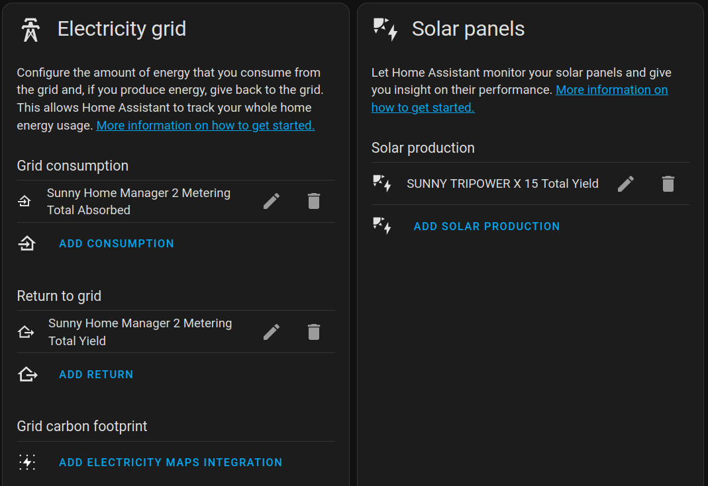
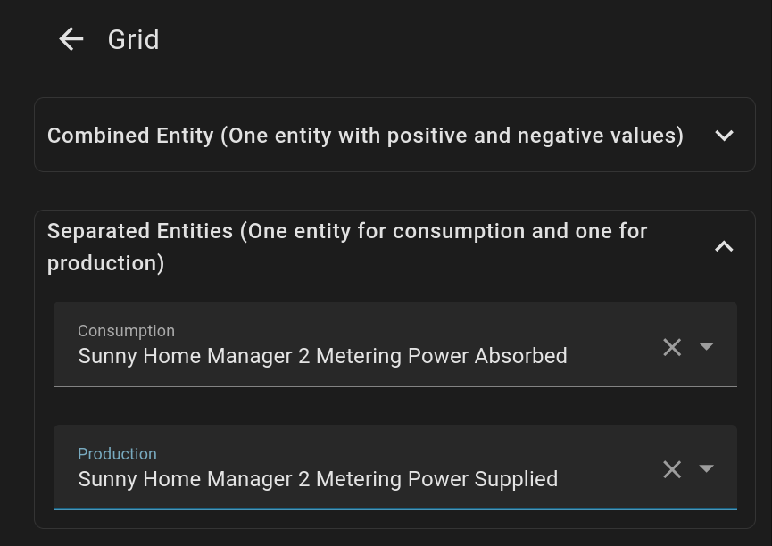
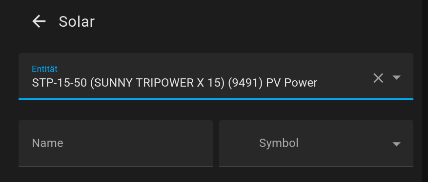

# HomeAssistant-Dashboards
## HA Energy Dashboard

The HA-Energy Dashboard shows consumption and production over time (hours, days, weeks, etc.).
If you want to see the current consumption, power-flow-card-plus can be set up.

| Area  | Mapping | provided by |
|---|---|--|
| Grid  | Grid Consumption:  Metering Total Absorbed   Return to Grid:  Metering Total Yield | Energy Meter  |
| Solar | Total Yield | inverter
| Battery |  - |XX | XX

## Power Flow Card Plus
https://github.com/flixlix/power-flow-card-plus

A typical configuration with an energy meter, an inverter and optionally a battery storage unit.

The dashboard shows the current situation. The current production, the current consumption and the current charging situation of the battery.

| Area  | Option   | Mapping | provided by |
|---|---|--|--|
| Grid  | Separate Entity | Consumption:  Metering Power Absorbed   Prdouction:  Metering Power Supplied | Energy Meter  |
| Solar | -     | PV Power | inverter
| Battery| Separate Entity | Consumption: Consumption: Battery Power Discharge Total  Production: Battery Power Charge Total | battery/inverter
| Battery |  - | State of charge: Battery SOC Total | battery/inverter

