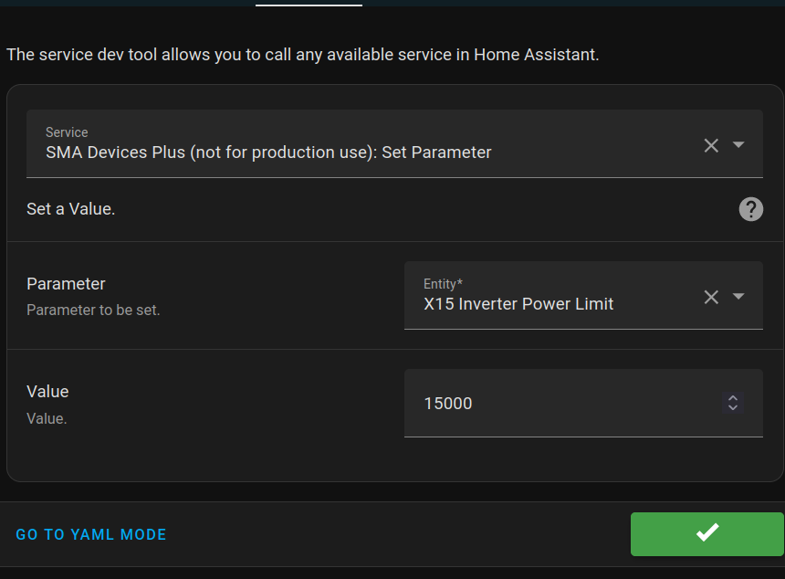
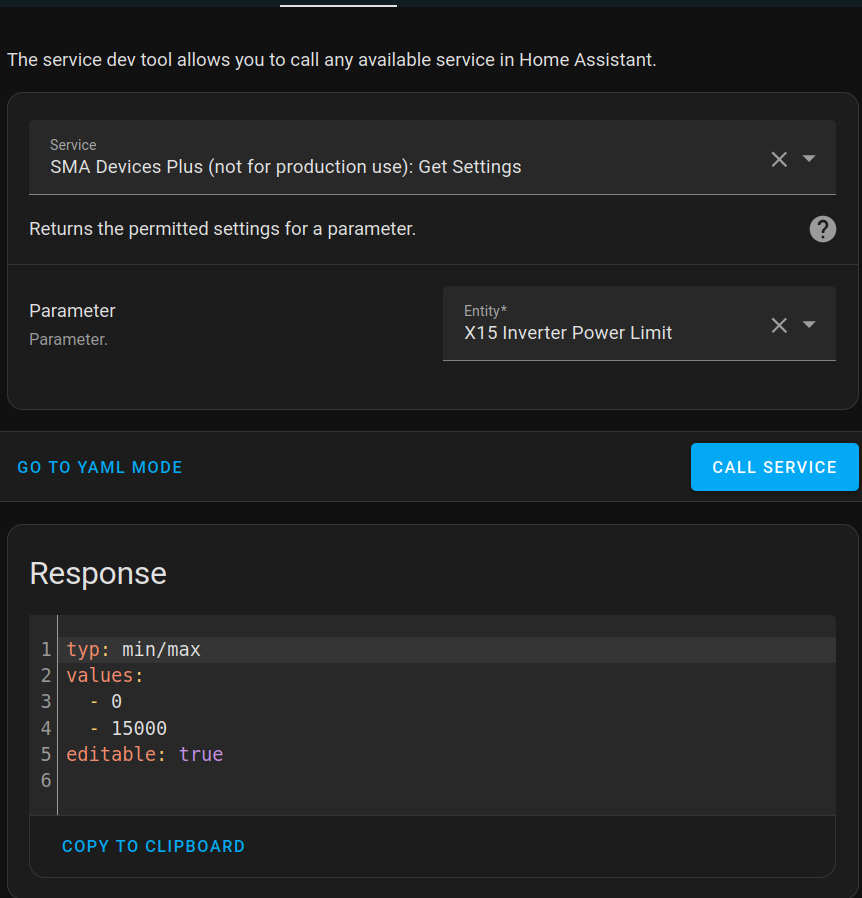

With enneox-OS based devices, it is possible to change selected parameters via Service Call.

Currently supported parameters:

| Interface | Sensor  | SMA-Name / Description |
|---|---|--|
| ennexos  | Inverter Power Limit | Set active power limit  Parameter.Inverter.WMax same as Modbus 30233

As a Tripower X device has over 400 parameters, I will not implement all of them. For additional parameters, please open an issue and briefly describe what you need the parameter for. 

Devices via Speedwire cannot be changed due to the lack of a specification. Here I refer to the use of Modbus.
In principle, support would be possible for devices of the Webconnect generation, but I am currently unable to implement it due to a lack of devices.  